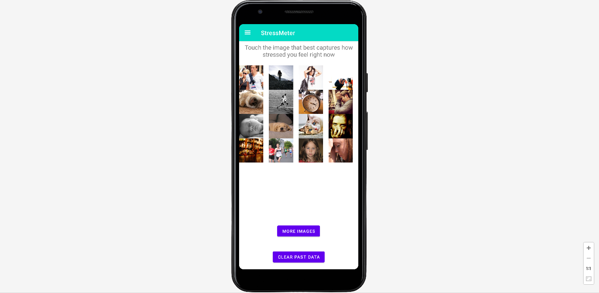
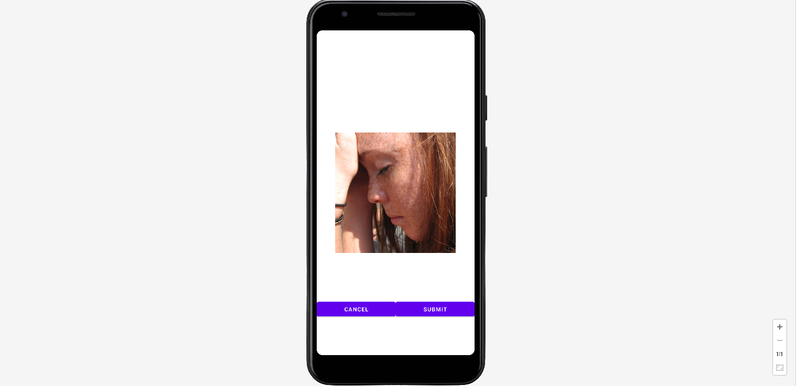
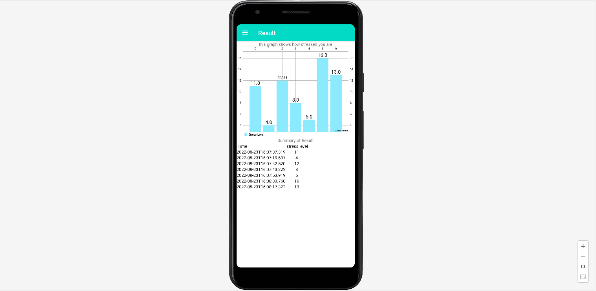
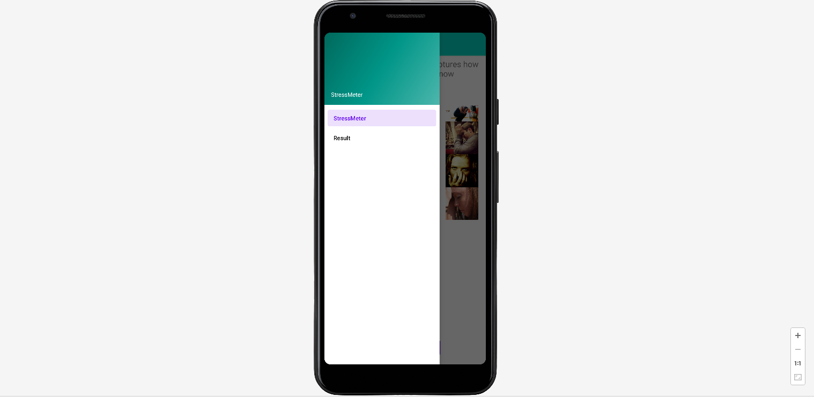

# Stress Meter
> mental health analyzing application with a simple bar chart

## Table of Contents
* [General Info](#general-information)
* [Features](#features)
* [Technologies Used](#technologies-used)
* [Screenshots](#screenshots)
* [Usage](#usage)
* [Project Status](#project-status)
* [Room for Improvement](#room-for-improvement)
* [Acknowledgements](#acknowledgements)
* [Contact](#contact)
<!-- * [License](#license) -->

<!--  what is it? for what ? and how??  -->
## General Information

- this is an app that help users visualize their day-to-day stress level.
-It allows users to capture how stressed they are at the moment, and then objectively see the data in a simple chart. 

- What is the purpose of your project?
-the purpose of this android application is to let users keep track of their stress level to help them navigate through their difficult time. it also allows users to see the stress levels in a intuitive bar chart to help them visualize their inner state. Because visualizing their inner state helps them to understand themselves, therfore they can take more appropriete actions.

## Features
- lets users choose from 48 pictures that each represent a different stress level.
- visualize the stress data in order for users to intuitively understand their inner state.
- Very easy to use & completely ad-free app

## Screenshots

MAIN PAGE

CONFIRMATION PAGE

VISUAL CHART PAGE

MENU BAR

<!-- If you have screenshots you'd like to share, include them here. -->

## Usage
You can download the apk file on your phone, and good to go

## Project Status
Project is: _in progress_

## Room for Improvement

Room for improvement:
- show exercise histories in a chart to let user see their fitness routine more easily
- use multi-thread design to make UI smoother.

## Acknowledgements

- This project was inspired by...
- This project was a part of the assignments from CMPT362(Android Mobile Applications Programming and Design) in Simon Fraser University, BC, Canada 
- Many thanks to... the professor XingDong Yang at SFU

## Contact
Created by [@HayatoKoyama](https://github.com/Hayato0512) - feel free to contact me at khayato0512.canada@gmail.com

<!-- Optional -->
<!-- ## License -->
<!-- This project is open source and available under the [... License](). -->

<!-- You don't have to include all sections - just the one's relevant to your project -->
